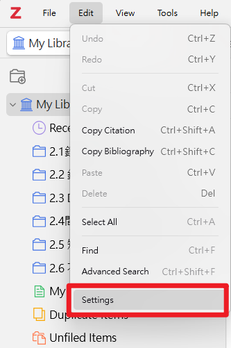
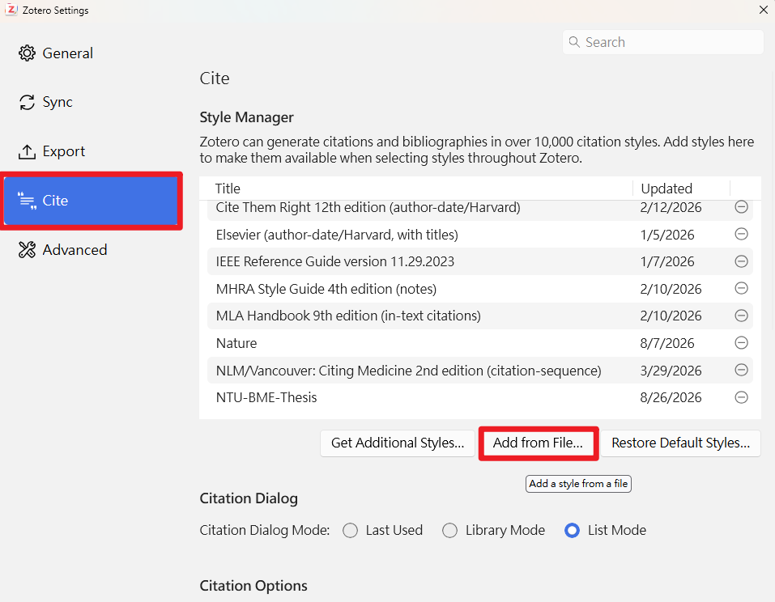
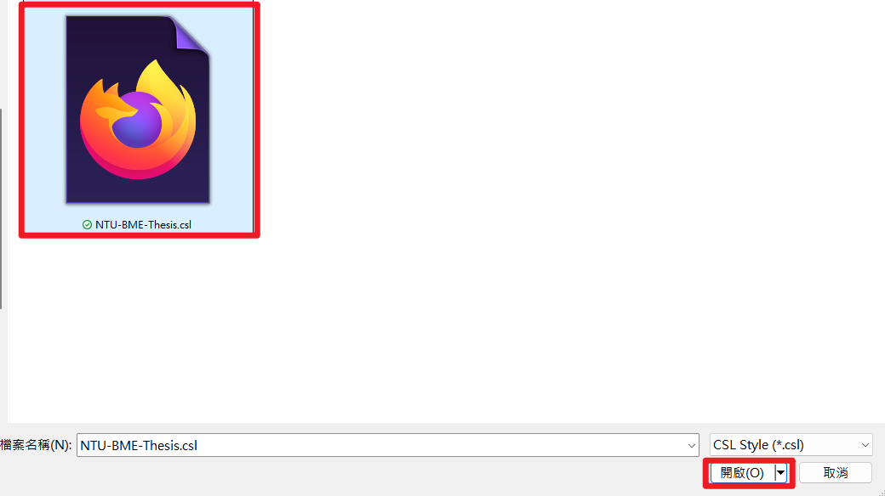
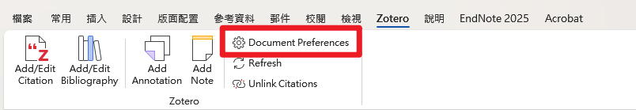
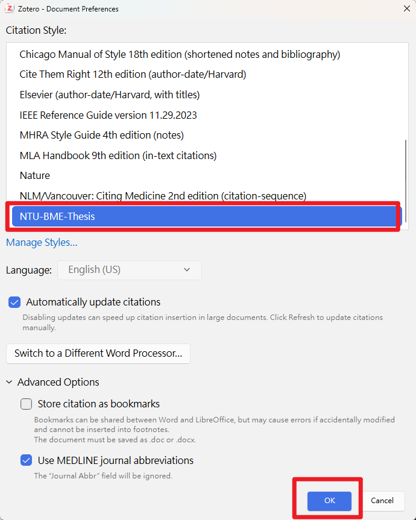
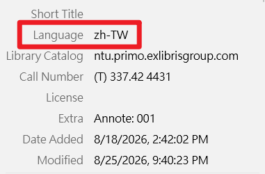
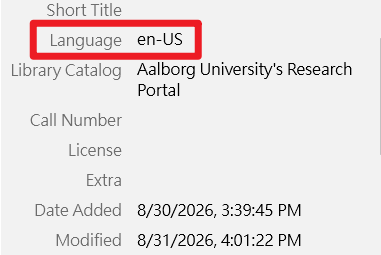
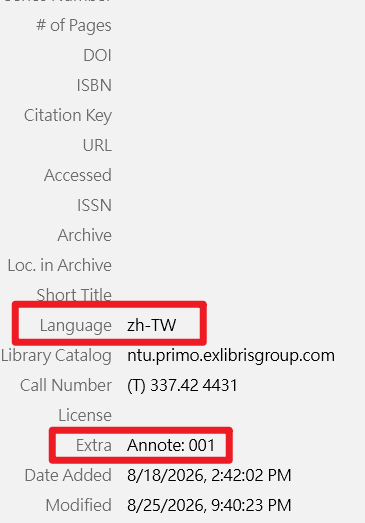
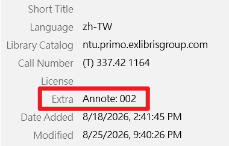

# NTU BME Thesis Zotero CSL

臺灣大學生物產業機電工程學系碩博士論文使用之非官方 Zotero CSL 樣式。

> [!IMPORTANT]
> 本專案並非臺大生機系官方發布之引用格式。
> Zotero 的基本安裝、書目匯入、Word 引用與引用格式操作，建議先參考臺灣大學圖書館官方 Zotero 教學。
> 本專案主要補充「臺大生機系論文引用格式」以及中英文文獻排序與格式設定。

## 📚 Zotero 基本教學

第一次使用 Zotero 的同學，建議先閱讀臺灣大學圖書館提供的：

### [書目管理軟體 Zotero 指引第一站](https://tul.blog.ntu.edu.tw/archives/37353)

內容包含：

- Zotero 安裝
- Zotero Connector
- 文獻資料匯入
- 文獻管理
- Microsoft Word 引用
- Bibliography 建立
- Citation Style 設定

---
## 🔧 本專案提供什麼？

本專案主要針對臺大生機系碩博士論文引用格式進行調整，包括：

- Author–Year 文中引用格式
- 中文、日文、英文文獻排序
- 中文文獻標點格式
- 英文文獻作者格式
- 同一作者依發表年份排序
- 中文姓氏筆畫人工排序方式
- Zotero `Language` 欄位設定
- Zotero `Extra / Annote` 欄位設定

本專案主要補充：

> **臺大生機系論文引用格式、中英文文獻格式與排序設定。**

---

# 📥 1. 安裝 NTU BME Thesis CSL

## Step 1：進入 Zotero Settings

開啟 Zotero 後：

`Edit → Settings`



---

## Step 2：進入 Cite

在 Settings 左側選擇：

`Cite`

接著按：

`Add from File...`



---

## Step 3：選擇 CSL 檔案

選擇本專案提供的：

NTU-BME-Thesis.csl



# 📝 2. 在 Microsoft Word 套用格式

開啟 Word 後，進入：

`Zotero → Document Preferences`



在 Citation Style 中選擇：

`NTU-BME-Thesis`




# 🌏 3. Language 設定

請在 Zotero 中統一設定文獻語言：

| 文獻語言 | Language |
|---|---|
| 中文 | `zh-TW` |
| 日文 | `ja` |
| 英文 | `en-US` |

此設定用於中、日、英文文獻的分組與排序。

中文:



英文:



請不要混用：
```text
Chinese
中文
Traditional Chinese
zh_TW
English
ENG
```

---

# 🇨🇳 4. 中文文獻設定

中文文獻的：
```text
Language
```
請設定成：
```text
zh-TW
```
另外，由於臺大生機系規定：

> **中文文獻應依作者姓氏筆畫順序排列。**
> 
目前 Zotero / CSL 無法可靠自動判斷繁體中文姓氏筆畫，因此本 CSL 使用 Zotero 的 `Extra `欄位人工指定排序。
例如第一順位：
```text
Language: zh-TW

Extra:
Annote: 001
```


下一順位：
```text
Language: zh-TW

Extra:
Annote: 002
```


依此類推：
```text
Annote: 001
Annote: 002
Annote: 003
...
Annote: 010
Annote: 011
```
> **[!NOTE]
`Annote` 除了作為中文文獻排序鍵，也用來觸發本 CSL 的中文格式，例如中文句號 `。`。**

# 🇺🇸 5. 英文文獻設定

中文文獻的：
```text
Language
```
請設定成：
```text
en-US
```

---
英文文獻的 `Extra` 不需要加入 `Annote`。
例如：
```text
Language: en-US

Extra:
（留空）
```
# 🔤 6. 文獻排序規則

臺大生機系論文參考文獻要求依：
1. 中文
2. 日文
3. 英文／歐文
排列。
同一作者有數篇文獻時，再依發表年份由舊至新排列。
本 CSL 的排序概念為：

```text
Language
↓
Chinese manual stroke-order key
↓
Author
↓
Year
↓
Title
```
因此請務必確認每篇英文文獻都有：
```text
Language: en-US
```
如果英文文獻沒有填寫 Language，可能會造成英文文獻無法正常依姓氏字母排序。

# ✍️ 7. 中文文獻格式

本csl檔已經設定好，當語言`zh-TW`會用`。` ， 語言`en-US`會用`.`


中文文獻範例：

> 田秉才、陳世銘、馮丁樹。1989。檸檬顏色選別裝置之研製。農業工程學報 35(4): 73-82。

英文文獻範例：

> Anderson, G. T., C. V. Renard, L. M. Strein, E. C. Cayo, and M. M. Mervin. 1998. Article title. Applied Eng. in Agric. 23(2): 34-42.

中文與英文文獻會依各自格式使用不同標點。

# 🔠 8. 英文文獻格式

英文文獻例如：
```text
Anderson, G. T., C. V. Renard, L. M. Strein, E. C. Cayo, and M. M. Mervin. 1998. Article title. Applied Eng. in Agric. 23(2): 34-42.
```
英文作者格式：
第一作者：

```text
Anderson, G. T.
```
第二作者之後：

```text
C. V. Renard
```
最後一位作者前使用：

```text
and
```

# 📖 9. 文中引用格式

## 括號式引用
一位作者：

```text
(Smith, 2020)
```
兩位作者：
```text
(Smith and Wang, 2020)
```
三位以上：
```text
(Smith et al., 2020)
```

## 敘述式引用：

如果作者名稱已經出現在句子中：

```text
Smith (2020) reported that ...
```
或：
```text
Smith et al. (2020) found that ...
```
在 Zotero Word Plugin 中可使用：
```text
Omit Author / Suppress Author
```
讓 Zotero 僅產生年份。


---

## 自行修改程式


### Based on

This CSL style was modified from the Citation Style Language (CSL) style for the American Society of Agricultural and Biological Engineers (ASABE) and adapted for NTU BME thesis formatting requirements.

Original attribution and licensing information are retained in the CSL file.

### Disclaimer

This is an unofficial community-maintained CSL style and is not officially provided or endorsed by National Taiwan University or the Department of Bio-Industrial Mechatronics Engineering.

If this CSL conflicts with the latest departmental thesis regulations, the official regulations shall prevail.
